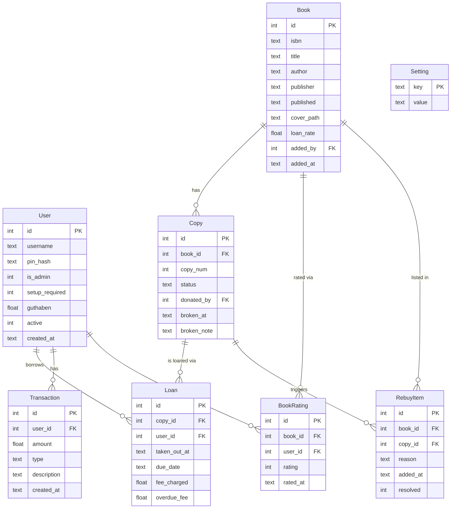
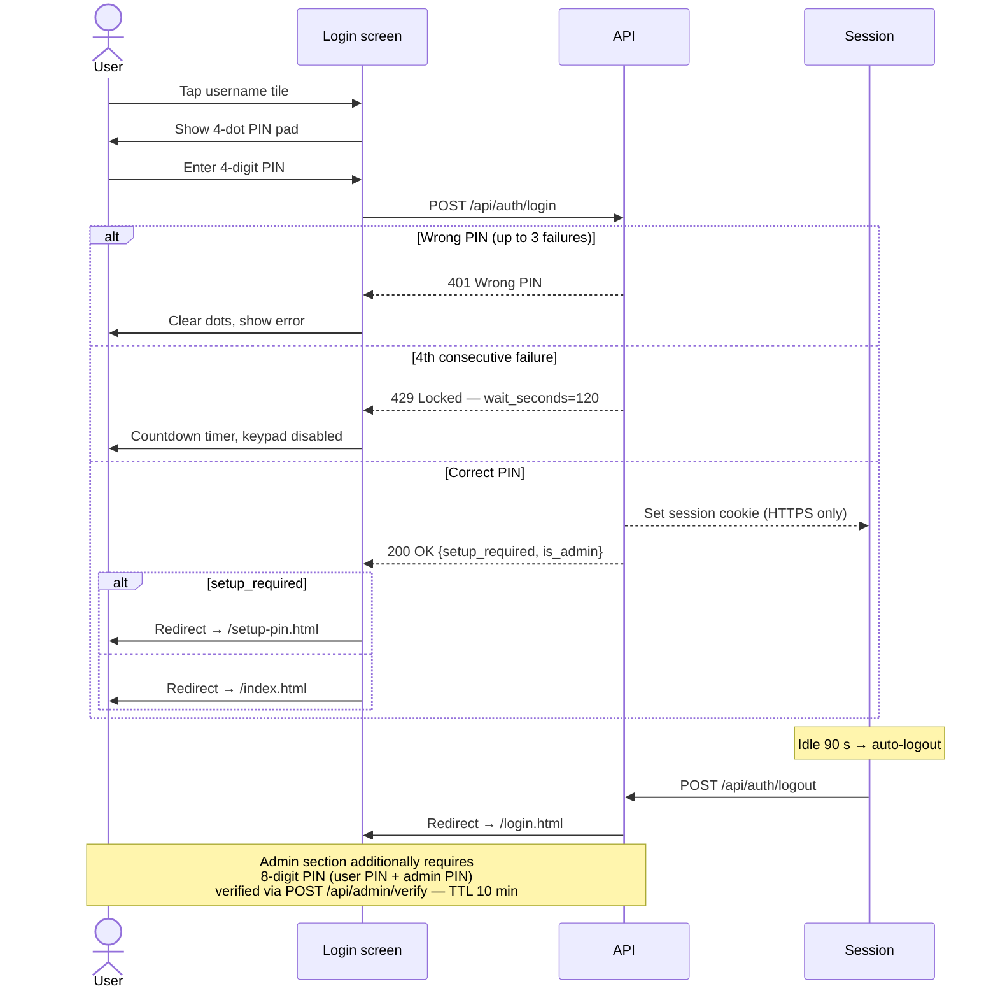
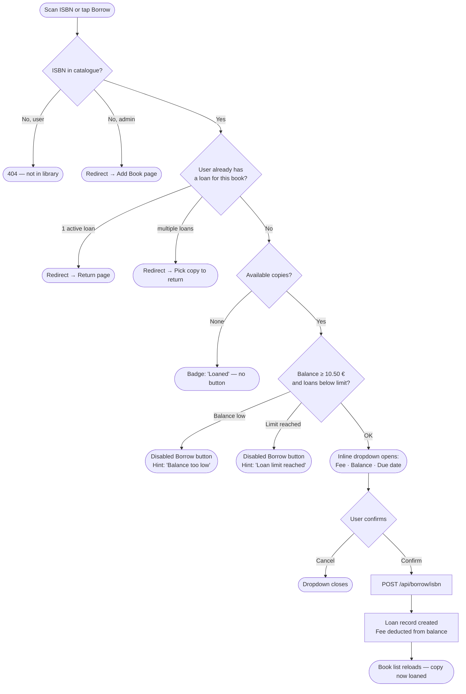

# MangaShelf

A self-hosted manga/book lending kiosk built for a Raspberry Pi touchscreen.


---

## Features

- **Book catalogue** — searchable list with cover images, availability badges, and inline borrow/return actions
- **Barcode scanning** — hardware USB scanner (keypress buffer) and camera-based scanning via ZXing (for phone or USB webcam)
- **Borrow / Return** — per-copy tracking, configurable loan period, per-book loan rate, overdue detection
- **User accounts** — PIN authentication, balance (Guthaben), top-up, transaction history, active loan overview
- **Deposit system** — new accounts start at 0 €; a 10 € deposit must be paid at the kiosk before borrowing is unlocked (minimum balance to borrow: deposit + smallest loan rate = 10.50 €)
- **Admin panel**
  - User management: promote/demote admin, activate/deactivate, set/force PIN, adjust balance, delete with confirmation
  - Overdue list with day counts
  - Rebuy list (auto-populated when last copy is marked broken)
  - Settings: max books per user, max loan days, default loan rate
- **QR login** — per-user QR codes for fast kiosk login without a keyboard
- **Phone scanner** — QR code on account page lets your phone act as a wireless barcode scanner
- **Onscreen keyboard** — toggleable QWERTY/QWERTZ soft keyboard (switches with language)
- **Multilingual** — English, German, Schwäbisch (easily extendable via `lang.json`)
- **Auto-logout** — session expires after 90 seconds of inactivity
- **Dark manga theme** — custom CSS design system, Permanent Marker font for titles, Font Awesome icons (all served locally, no CDN)

---

## Tech Stack

| Layer | Technology |
|---|---|
| Backend | Python · FastAPI · SQLAlchemy · SQLite |
| Auth | Starlette session middleware · bcrypt |
| Frontend | Vanilla JS · HTML/CSS (no framework) |
| ISBN lookup | OpenLibrary API · Google Books API (with ISBN-13 ↔ ISBN-10 fallback) |
| Cover cache | Automatic download and local caching |
| Scheduler | APScheduler (overdue fee processing) |
| Deployment | Docker · systemd service · Chromium kiosk mode · Raspberry Pi OS |

---

## Screenshots

| Login | Book List | Account |
|---|---|---|
|  |  |  |

---

## Data Model



---

## Authentication Flow



---

## Borrow Flow



---

## Quick Start — Docker

```bash
# 1. Clone the project
git clone https://github.com/01msmr/mangashelf.git
cd mangashelf

# 2. Set your secret key in docker-compose.yml, then start
docker compose up -d
```

Open **http://localhost** in a browser.
Default credentials: **admin** / PIN **0000** — you will be asked to change the PIN on first login.

### Update

```bash
git pull
docker compose up -d --build
```

### Environment variables

| Variable | Default | Description |
|---|---|---|
| `SECRET_KEY` | `mangashelf-dev-secret-change-in-production` | Session signing key — **change this in production** |

Set it in `docker-compose.yml` under `environment`.

---

## Quick Start — local development (without Docker)

```bash
# 1. Clone and enter the project
git clone https://github.com/01msmr/mangashelf.git
cd mangashelf

# 2. Create virtualenv and install dependencies
python3 -m venv venv
source venv/bin/activate
pip install -r requirements.txt

# 3. Seed the database with an admin user
python seed.py        # creates mangashelf.db, default admin: admin / PIN 0000

# 4. Run  (self-signed TLS certificate is generated automatically on first start)
python run.py
```

Open **https://localhost:5001** (accept the self-signed cert warning).

---

## Raspberry Pi Deployment

Tested on Raspberry Pi OS Bookworm/Bullseye with a 800 × 480 HDMI display.

### Option A — Docker on the Pi

```bash
# Install Docker on the Pi (if not already installed)
curl -fsSL https://get.docker.com | sh

# Clone and start
git clone https://github.com/01msmr/mangashelf.git
cd mangashelf
docker compose up -d
```

Then configure Chromium kiosk mode to open `http://localhost`.

To update later: `git pull && docker compose up -d --build`

### Option B — systemd service (no Docker)

```bash
# On the Pi, clone the project to /home/pi/mangashelf, then:
sudo bash deploy/install.sh
sudo reboot
```

The installer:
1. Installs system packages (`chromium-browser`, `unclutter`, `xdotool`)
2. Creates a Python virtualenv and installs Python dependencies
3. Seeds the database (only if `mangashelf.db` does not exist yet)
4. Installs and starts a **systemd service** (`mangashelf.service`)
5. Configures **Chromium kiosk mode** via LXDE autostart (launches on boot, full-screen, no cursor after 3 s, `--enable-virtual-keyboard` for system OSK on text fields)
6. Enables desktop auto-login for the `pi` user

After reboot the kiosk opens automatically at `https://localhost:5001`.

### Useful commands

```bash
# Docker
docker compose logs -f
docker compose restart
docker compose up -d --build   # after git pull

# systemd
sudo systemctl status mangashelf
sudo systemctl restart mangashelf
journalctl -u mangashelf -f
```

---

## Project Structure

```
mangashelf/
├── app/
│   ├── main.py              # FastAPI app factory
│   ├── models.py            # SQLAlchemy models (User, Book, Copy, Loan, …)
│   ├── dependencies.py      # Auth dependencies (get_current_user, get_current_admin)
│   ├── routers/             # API routes (auth, books, loans, account, admin)
│   ├── services/
│   │   ├── isbn_lookup.py   # OpenLibrary + Google Books with ISBN-13/10 fallback
│   │   ├── cover_cache.py   # Cover image download and caching
│   │   ├── finance.py       # Balance / fee helpers + DEPOSIT / LOAN_RATES / BORROW_MIN constants
│   │   └── scheduler.py     # APScheduler jobs (overdue processing)
│   └── static/
│       ├── index.html       # Book list (main kiosk view)
│       ├── account.html     # User account / top-up / loans
│       ├── admin/           # Admin panel pages
│       ├── js/
│       │   ├── api.js       # Thin fetch wrapper
│       │   ├── nav.js       # Header / navigation rendering + 90 s idle timer + admin PIN gate
│       │   ├── numpad.js    # Floating numpad widget (amount inputs)
│       │   ├── pin.js       # Shared PIN entry widget (makePinField)
│       │   ├── rating.js    # Star rating widget (1–9)
│       │   └── lang.js      # i18n module (reads lang.json, supports {{var}} placeholders)
│       ├── css/style.css    # Design system (dark manga theme)
│       ├── lang.json        # Translation strings (en, de, schwaebisch)
│       └── fonts/           # Local Font Awesome + Permanent Marker (no CDN)
├── deploy/
│   ├── install.sh           # One-shot Raspberry Pi installer
│   ├── mangashelf.service   # systemd unit file
│   └── autostart            # LXDE kiosk autostart config
├── requirements.txt
├── seed.py                  # Populate DB with default admin user
└── run.py                   # Entry point — auto-generates TLS cert, starts uvicorn on :5001
```

---

## Adding Books

Books can be added from the **Admin → Add Book** page by:
- Entering or scanning an ISBN (USB barcode scanner or camera)
- Clicking the lookup button — metadata and cover are fetched automatically from OpenLibrary / Google Books
- Adjusting title, author, loan rate, and number of copies, then saving

ISBN-13 and ISBN-10 are both tried automatically when lookup fails for one form.

---

## Extending Languages

Edit `app/static/lang.json` and add a new top-level key with the same string keys as `"en"`. The language switcher on the account page picks it up automatically. Set `"_keyboard": "qwerty"` or `"qwertz"` to control the onscreen keyboard layout for that language. Strings support `{{var}}` placeholders that are resolved at render time (e.g. `{{min}}` for the minimum borrow balance).

---

## License

MIT
